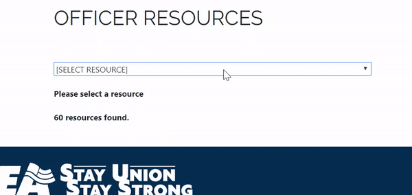

# Coding-Samples
These are some code samples that show off my abilities using PHP, Javascript and Java. The two officer_resources files are examples of a small application that I worked on at my most recent employeer, CSEA.

1. officer_resources_include.php - This file changes the content of a webpage to display resources based on the ranking of the user. It calls the API twice to check the user's officer title and another to retrieve the resources.

2. officer_resources.js - This file is part of the API that the PHP file calls to fetch the data. It has many routers to retrieve, insert and update data.

 
